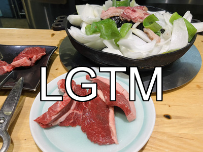

# LGTMジェネレーター（LGTM Generator）

🚀 **LGTMマスターが新たな作品を生み出した！** 🎉

この Python スクリプトは、指定した画像に **「LGTM (Look Good To Me)」** のようなテキストを追加し、新しい画像として保存するツールです。

## **📌 特徴**
- **テキストのカスタマイズ**（フォント、サイズ、色、位置など）
- **画像のリサイズ**（拡大・縮小・指定サイズへの変更）
- **テキストのアウトライン（縁取り）**
- **座標やフォントサイズをパーセント指定可能**
- **JPEG/PNG の保存対応**
- **OSに応じたデフォルトフォントの自動選択**
- **画像の検証とエラーハンドリング**

---

## **🔧 事前準備**
- Python 3.x
- 必要なライブラリをインストール（Pillow など）

```bash
pip install -r requirements.txt
```

---

## **🚀 使い方**
1. 画像ファイルを用意する（スクリプトと同じフォルダに置くか、パスを指定）
2. 以下のように実行する

```bash
python generate_lgtm.py <画像ファイルのパス> [オプション]
```

**📌 実行例**
```bash
python generate_lgtm.py example.png -t "Hello" -f "Arial.ttf" -s 10pct -c "#FF0000" -p bottom -o output_image.png
```
このコマンドの意味：
- **example.png** に **「Hello」** を追加
- **フォント: Arial.ttf**
- **サイズ: 画像の高さの 10%**
- **テキストカラー: 赤 (#FF0000)**
- **位置: 画像の下部**
- **出力ファイル: `output_image.png`**

---

## **🛠️ オプション一覧**
| オプション           | 短縮形 | 説明 |
|----------------------|------|----------------------------------------------------------|
| `--text`            | `-t`  | 追加するテキストを指定 |  
| `--font`            | `-f`  | 使用するフォントファイルを指定 |
| `--size`            | `-s`  | **フォントサイズを指定**（px または `pct` で相対指定可）|
| `--color`           | `-c`  | **テキストの色**（RGB, カラーコード, 色名対応） |
| `--outline-color`   | `-oc` | **アウトライン色を指定**（RGB, カラーコード, 色名対応）|
| `--outline-width`   | `-ow` | **アウトラインの太さ**（ピクセル単位、デフォルト: 2）|
| `--position`        | `-p`  | **テキストの縦方向の配置**（`top`, `bottom`, `center`）|
| `--x`              | `-x`  | **X座標を指定**（px または `pct` で相対指定可） |
| `--y`              | `-y`  | **Y座標を指定**（px または `pct` で相対指定可） |
| `--resize`         | `-r`  | **画像のサイズを変更**（`150pct` で拡大, `800x600` で固定サイズ） |
| `--output`         | `-o`  | **出力ファイルのパスを指定**（省略時は「_lgtm」付きで保存） |

---

## **📌 追加機能の詳細**
### **1️⃣ フォントサイズ・座標のパーセント指定**
```bash
python generate_lgtm.py example.png -s 10pct -x 50pct -y 50pct
```
- **フォントサイズ → 画像の高さの10%**
- **X座標 → 画像の幅の50%**
- **Y座標 → 画像の高さの50%**

---

### **2️⃣ 画像サイズの変更**
```bash
python generate_lgtm.py example.png -r 150pct
```
- **画像を 150% に拡大**

```bash
python generate_lgtm.py example.png -r 800x600
```
- **800x600 にリサイズ**

---

### **3️⃣ テキストのアウトライン**
```bash
python generate_lgtm.py example.png -oc black -ow 2
```
- **黒色のアウトラインを追加（太さ: 2ピクセル）**

```bash
python generate_lgtm.py example.png -oc "(255,255,0)" -ow 3
```
- **黄色 `(255,255,0)` のアウトラインを追加（太さ: 3ピクセル）**

---

## **⚠️ 制限事項**
- リサイズ後の画像サイズは最小10x10ピクセル、最大10000x10000ピクセル
- フォントファイルが見つからない場合は、OSに応じたデフォルトフォントを使用
  - Windows: Arial
  - macOS: Helvetica
  - Linux: DejaVu Sans

---

## **🎨 出力例**
**元の画像**


**コマンド**
```bash
python generate_lgtm.py sample.jpg -s 30pct -oc black -ow 2
```

**出力されたLGTM画像**



---

あなたも **オリジナルLGTM画像** を作ってみよう！💪🔥

